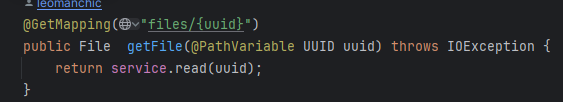
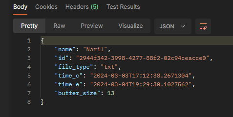

# Создание веб-сервисов RESTful с помощью Spring Framework
## Тема: "Файловая система"
### Экспорт и импорт данных в заданном формате:
 **Flat-file** fixed width columns 
---
### Создание сервиса для управления объектами на основе REST API. Разработка методов обработки http-запросов:

- [x] Добавление объекта

- [x] Удаление объекта

- [x] Просмотр объекта

- [x] Вывод сводной информации о хранимых объектах (количество или статистические функции)

- [ ] Сведения о работе и студенте - в заголовках пакетов

- [x] Сохранение/восстановление данных в файл

- [ ] Тестирование запросов и анализ содержимого http-пакета для запросов и ответов.

--- 
#### [Пример хранения](data.txt)


---
### Ресурсы 
[Что такое flat-file](https://appmaster.io/ru/blog/chto-takoe-ploskii-fail)\
[Flat file model wiki](https://en.wikipedia.org/wiki/Flat-file_database)\
[Учебная практика](https://www.козьяков.мир.рус/%D0%B4%D0%B8%D1%81%D1%86%D0%B8%D0%BF%D0%BB%D0%B8%D0%BD%D1%8B/%D1%83%D1%87%D0%B5%D0%B1%D0%BD%D0%B0%D1%8F-%D0%BF%D1%80%D0%B0%D0%BA%D1%82%D0%B8%D0%BA%D0%B0)\
[REST в джава](https://javarush.com/groups/posts/2486-obzor-rest-chastjh-1-chto-takoe-rest)

### Тестирование с Postman
1. Получение файла по uuid
\
тело запроса ```
http://localhost:8080/api/files/2944f342-3998-4277-88f2-02c94ceacce0``` 


2. Получение всех файлов файловой системы\
   тело запроса ```get
   http://localhost:8080/api/files```
3. Удаление файла по uuid\
   тело запроса ```delete
   http://localhost:8080/api/files/2944f342-3998-4277-88f2-02c94ceacce0```